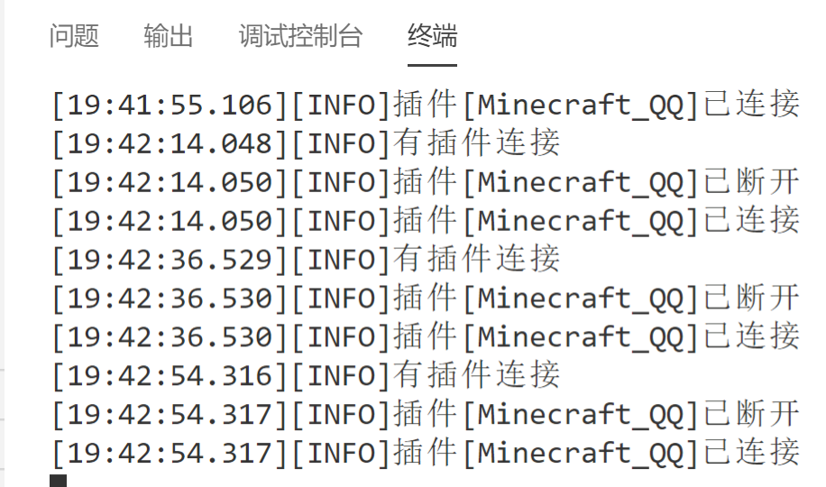
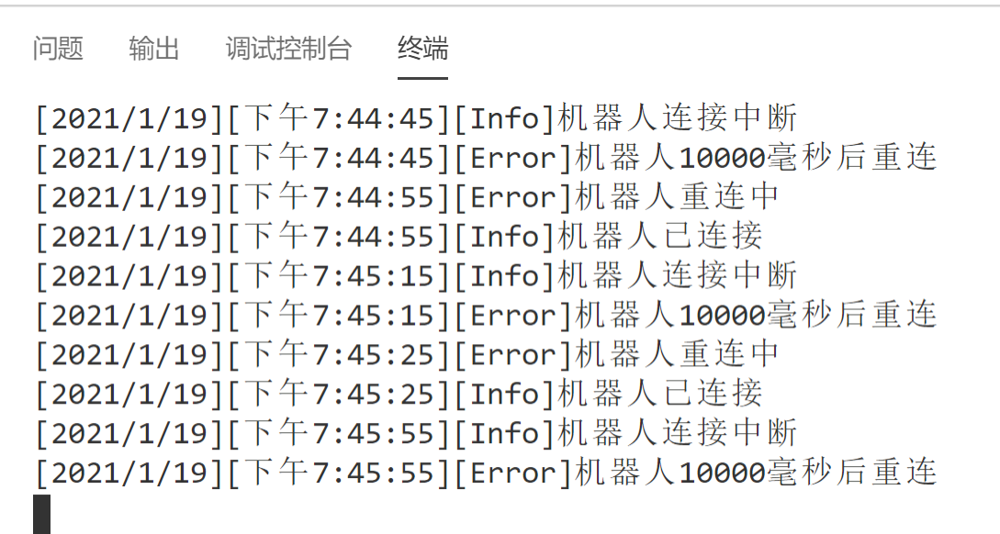
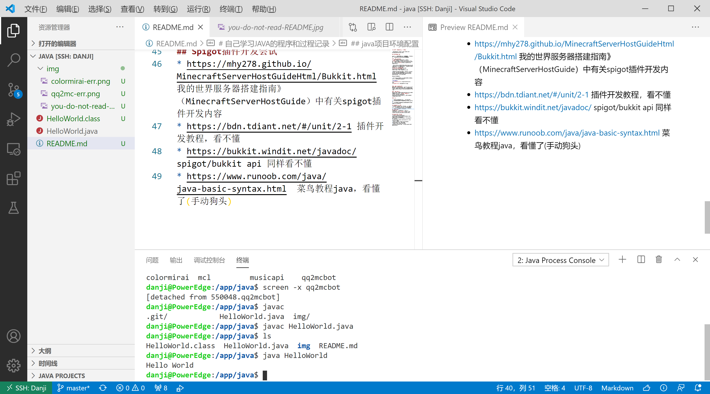

# 自己学习JAVA的程序和过程记录

* Markdown教程 https://www.runoob.com/markdown/md-tutorial.html

>提示：本项目需要一定linux与编程基础阅读。没有也行，Baidu.com、Google.com、Bing.com 是最好的老师。linux可以看鸟哥的私房菜。我有很多电子书……需要的可以联系我(手动狗头) hailay@qq.com

## 自学JAVA的原因

到底是为什么要学这么多语言呢？？？为什么又要多学一个很久之后学校会学的JAVA呢？？？

### 原因1 插件配置
> 原因是这样的：某Minecraft开发者(@[Coloryr](https://github.com/Coloryr))开发了一个可以让QQ信息和Minecraft聊天信息互通的插件和软件，借助[mirai](https://github.com/mamoe/mirai).

> 这个作者我非常佩服，写的插件[All_MusicP](https://github.com/HeartAge/AllMusic_P)+[All_MusicM](https://github.com/HeartAge/AllMusic_M/)我都很喜欢用。只是有一点点不太好…… 配置文档太少了！还疯狂让我们看README.md……  
我来回看了好几遍都配置不好，急死了

>这时候在群里问，群里面的一个大佬“@柠玥”帮我解答了一下，然后我就请求大佬远程借助帮忙在Windows10上整了好久……好了！ 最后我把软件用Ubuntu20.04打开，能用！真棒！

成与斯，败如斯。

>在群和Minecraft服务器上测试后发现，插件会经常掉线,只会时不时发条信息……

**断联问题**

### 原因2 自己的能力……
最恐怖的是，意识到了自己开了三年多Minecraft竟然只会简单地配置些插件、安装些软件……最多就到安装个宝塔装个网站、在linux安装包的地步……真没用。

### 原因3 大佬建议
大佬@柠玥提议不如自己写插件，至少自己能尝试解决问题…… 还丢给我一个[如何开服的教程](https://github.com/Mhy278/MinecraftServerHostGuide)，也是众多mcbbs大佬写的，极其受用。

### 小结

1. 不写详细的README.md打死也不看这个项目
2. 自己写项目要写详细的文档，方便别人也方便自己
3. 能自己干的事情就不要让别人代劳了……自己写出来的东西，用得放心

## java项目环境配置
>小结：openjdk14 + Ubuntu20.04 LTS + VScode remote-ssh

* 我首先在 windows 下用 VScode 加上 jdk14，结果加环境变量后，javac 没反应……可能要重启 [参考文章](http://blog.hotsun168.com/index.php/archives/10/)
* 于是我用 Vscode 的 remote-ssh 连接了丹姬（局域网内ubuntu服务器），然后就能行了  
* 多版本java切换 `sudo update-alternatives --config java`  
    openjdk14安装 `sudo apt install openjdk-14-jdk-headless -y`  
    忘记名字用 `apt search openjdk-14` 查名字233
* 还要调环境变量 `sudo vim /etc/profile`  ,在后面加  
`JAVA_HOME=/usr/lib/jvm/java-14-openjdk-amd64/
PATH=$JAVA_HOME/bin:$PATH
CLASSPATH=$JAVA_HOME/jre/lib/ext:$JAVA_HOME/lib/toos.jar
export PATH JAVA_HOME CLASSPATH`
    然后保存配置 `source /etc/profile` 
    > 注意，这条指令只能让环境变量在该终端生效。最好`reboot`或者关闭ssh和vscode重新连, 让它全局生效 
    * [export的作用](https://www.runoob.com/linux/linux-comm-export.html) 设置本次登录[环境变量](https://www.cnblogs.com/ifreeky/articles/8424296.html)

> 还是linux下开发东西方便，windows都是些什么鬼……  
完全不用搞懂怎么来，只知道用……

## 本项目结构
/README.md 一个文档介绍完所有的东西  
/HelloWorld.java [菜鸟教程](https://www.runoob.com/java/java-basic-syntax.html)

## Spigot插件开发尝试
* https://mhy278.github.io/MinecraftServerHostGuideHtml/Bukkit.html 我的世界服务器搭建指南》（MinecraftServerHostGuide）中有关spigot插件开发内容
* https://bdn.tdiant.net/#/unit/2-1 插件开发教程，看不懂  
* https://bukkit.windit.net/javadoc/ spigot/bukkit api 同样看不懂  
* https://www.runoob.com/java/java-basic-syntax.html  菜鸟教程java，看懂了(手动狗头)

## QQ和Minecraft消息互通软件设计想法
* 尝试利用[mcsm](https://github.com/Suwings/MCSManager)的[api](https://github.com/Suwings/MCSManager/wiki/API-Documentation),发现好像没有返回控制台信息的api，只有发送指令的api，不全面